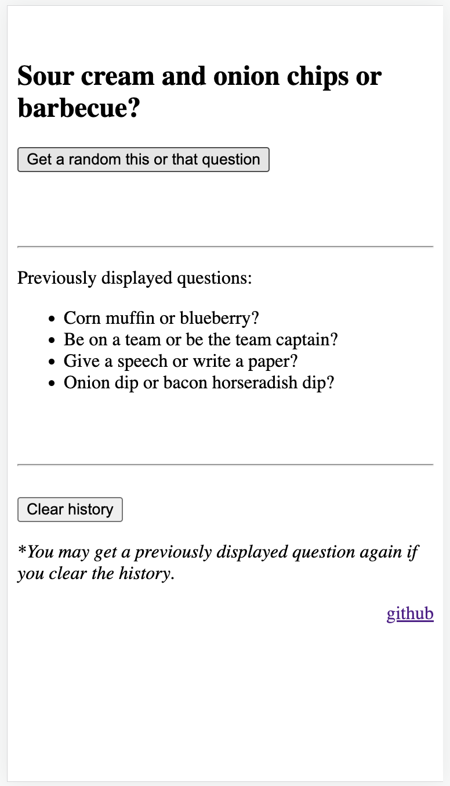

# Random This or That Questions

Gets a random this or that question out of 598 questions listed on [this file](./questions.json)

Can be used on: https://thisorthatquestions.github.io/

Keeps history in order to not repeat questions.
History can be cleared.

Screenshot:

